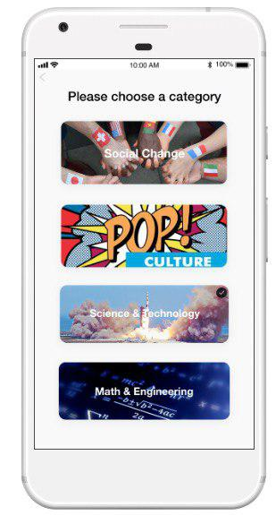
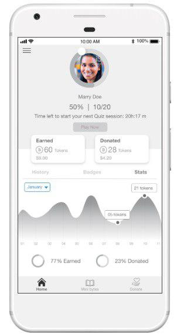
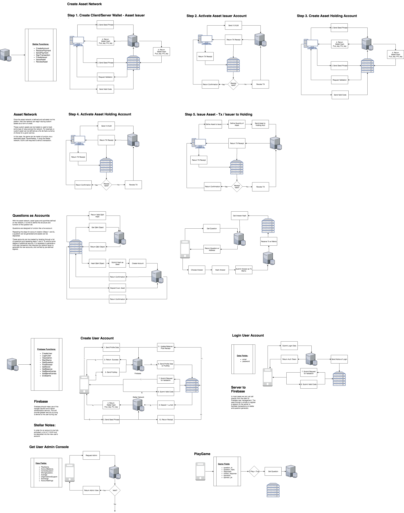

# Undiscovered Story PWA "Learn and Earn" Cryptocurrency Game and Architecture utilizing Google FireBase, Amazon AWS and the Stellar Blockchain.

<!--  -->

<!--  -->

 
# 50 Word Stellar pitch 
 
Undiscovered Story, is a “learn & Earn” Blockchain Progressive Web Application based Trivia game that celebrates the acheivments of Girls & Women throughout history.  The game rewards players with cryptocurrency, is intended for mass adoption and is easy, fun and engaging to play. 

Undiscovered Story, is a “learn & Earn” Blockchain Progressive Web Application based Trivia game that celebrates the acheivments of Girls & Women throughout history.  The game rewards players with cryptocurrency, is intended for mass adoption and is easy, fun and engaging to play.  The game has been designed to support and empower players to be global agents of social change.  

One of the glaring problems with almost every blockchain and cryptocurrency based product or service is that they are generally not easily usable by the average person.  We have discovered through our face to face interviews and online research with everyday persons, including moms, dads, young adults and teens, that unless a product is easy to use mass adoption of blockchain and cryptocurrency product or service is not going to happen.

# What technology is the company/team going to build? *
Undiscovered Story has been built, was released as a beta test product during May 2019 and utilizes a Stellar blockchain smart contract, and a Stellar XLM based token called UDGT. The front end is a Progressive Web Application (PWA) built using ReactJS with the backend utilising NodeJS, Stellar, MongoDB, Firebase, Firestore and Heroku.
Every initial registered game player is given the games Stellar wallet with a predetermined amount of Undiscovered Story Game Tokens (UDGT). For every correct answer, a game player is rewarded with a deposit of UDGT into their wallet. When players choose the incorrect answers, a portion of any rewards are also deducted from the game player’s wallet, and distributed to a network of verified charities operating around the world utilizing a Stellar smart contract.

The game also features a permission based social good advertisement system.  Most everyone we have interviewed does not like being interrupted by advertisements, and most either turn down the volume or walk away to do something else while an ad plays.  Our technical solution has permissioned based advertisements at the end of the game leaving the game player in full control. 
The ads feature only a comment bar.  If a game player views the ad until the end, and offers a constructive comment to the advertising partner, they will receive a reward creating a win-win solution and relationship for the game player and the advertiser.   The game player wins by being rewarded with UDGT, and the advertiser wins by knowing that their ad has been watched fully.

# How will the technology integrate with Stellar? *
Undiscovered Story leverages Stellar blockchain smart contracts to form the underlying backbone for payment distribution among Undiscovered Story game players.  Undiscovered Story also uses Stellar based wallets. 

The frontend is developed on ReactJS and backend is developed on NodeJS from where the API’s are being served.
Heroku is used as a middle tier/server to serve the Stellar Smart Contract as well as Firebase API´s which are responsible to fetch and push the data from Firebase according to the request being made.

# Offchain gaming mechanism
We are using two services from Firebase: 
Hosting (Our app is hosted on firebase’s hosting platform )
Firestore (That is our realtime database) 

The Firebase service for the database is entirely serving the offchain gaming mechanism. This permits us to perform future game upgrades without affecting the Stellar smart contract and the transctions made through the smart contract. 
This offchain gaming mechanism records the transactions made on the Stellar smart contract, with the responses of every transaction being recorded in the Firebase/Forestore database in realtime.

This implementation allows us to always have a backup record of every transaction that occurs or has occured.  This offchain gaming mechanism allows for extra protection of game user data in case of any major changes or updates to the Stellar network. 

Our team has created more than 16 custom  API’s to serve different modules of our application which involves onchain Stellar smart contract API’s and offchain ( Firebase and Firestore ) and working harmoniusly together.

# What language and dependencies will you use? Will this project be open source

The front end of our Progressive Web Application based game is built using ReactJS with the backend utilising NodeJS, Stellar, MongoDB, Firebase and Heroku.

Currently the project 50% open source with 50% being closed, although we are willing to make the project 100% open source should we receive a grant.

# Dr. Justin Smith

Is a data scientist who specializes in complex systems modeling, topological data analysis, and natural language processing. He has worked extensively in the area of sustainability, and collective intelligence focusing broadly on the use of science and technology to improve the resilience of social-ecological systems. In 2017, Dr. Smith was named the extension/GODAN data science fellow sponsored by USDA-NIFA, where he developed methods for inferring ontologies from unstructured text data. Justin is a co-Founder of DirectHarvest, where he served as the Chief Innovation Officer and R&D Lead before acquisition by Producers Market in 2018. 

He founded the Community Intelligence Lab @ WSU, an experimental public think tank to facilitate informed citizen engagement in local governance, and he currently serves on the Board of Directors at the Public Sphere Project, a non-profit focused on research and developing technologies that support civic intelligence. Justin completed his PhD in 2013 at WSU. His doctoral research focused on the influence of ethical value in driving consumer decision making. Upon completing his dissertation, Justin was awarded a postdoctoral fellowship at Cornell University funded by the EPA. Prior to completing his doctoral work, Justin worked as a data scientist in computer vision, an organic farmer,  and web developer. He holds a Masters degree in International Development Economics from St. Marys University, and completed a self-designed BA in community informatics at The Evergreen State College in Olympia, WA.

# Nikita Mittal, Senior Lead Clientside Developer
Nikita is a software engineer who obtained her computer science degree at JSSATE in Noida, India. She is an expert at delevoping architectures and algorithms, IoT, AI, and Blockchain, she enjoys experimenting with new technologies and optimizing algorithms so technology can better meet humanity’s growing needs

# Ayman Afzal, Senior Lead Backend Developer
Ayman has developed custom-built, complex ERP (enterprise resource planning) systems for banks, hospitals and corporations.  He is passionate and has extensive expertise in crafting both server and client-side code.

# Ayshwarya Shyam, Senior Lead UI/UX Developer
Ayshwarya is a UX and UI designer with a deep empathy for people and a natural affinity for human behavior. A believer in design as relational–beyond aesthetic–she is committed to providing solutions that connect to the “hearts” of users. She is motivated by meeting user needs and is always passionate to learn how new technologies can meet those needs.

# Kiran Paturi , Senior SmartContract Developer
Kiran is an expert software engineer and product manager and has an extensive track record of devising unique solutions for large blockchain projects. He is naturally drawn to, cutting-edge technologies and implementation methodologies, which lead to his work developing DAPPs, Wallets, ICO’s and Exchanges. He is a passionate and enthusiastic contributor to the field of Blockchain and has worked with Stellar, Ethereum, Bitcoin, Hyperledger, R3-corda and Holochain.

# Uday Seethamsetty, Senior Blockchain Solution Architect
Uday Kumar Seethamsetty is Adroit & Certified IOT Blockchain Solution Architect with over 12+ years of experience including R&D Wing Setups. He is a frequent contributor, speaker and advisor on blockchain and cryptocurrencies and leads teams in work on decentralized blockchain projects. Uday also has a Robotic Process Automation (RPA) certification and has served as a technical subject matter expert in the insurance and banking industries. He has also made contributions in various other fields, including robotics and process automation

# The Undiscovered Story Game Token (UDGT) Architecture we designed in house for Stellar Blockchain Gaming

